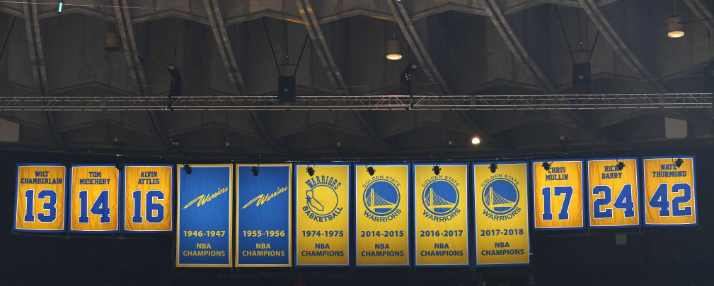

I wrote an essay titled "Building the Golden State Warriors" a semester ago. It was about what I thought was most important to working in a software development project with a team. It covered leadership, communication between team members, and other steps I thought one should take towards successful development of a project. This time I want to stress over the consequences of poor leadership, poor communication, and anything else that could happen during a team project. 

But some context before moving forward - I had the wonderful opportunity to be able to work on a project for an actual client this past semester. The goal was to create a sort of VolunteerMatch competitor platform, and after an initial meeting with the client we were provided a 'wishlist' of features she'd like to see implemented on this application. The class was initially split into five groups of eight students, and while each group worked independently from each other we effectively worked on the same project building 'prototype' applications. My team, after quickly getting to know each other, went to work by setting up the project using a template and creating some user stories to address the type of features we'd expect a user to want from this application. We also set up a group Discord to efficiently communicate messages with the group or individuals.

## Lack of Motivation

The final project initially began as a submission for the Hawaii Annual Coding Challenge (HACC). HACC registration did not require a team, but realistically as someone with no prior experience or knowledge in full stack development participating with a team made the most sense. Quickly, I managed to team up with three others in my class. And when it came time to submit our application we had to choose a team leader to submit everything. Selecting me as leader came (unsurprisingly) quick since everyone else preferred not to be in that position. It was after this point in the project that quickly came to understand two (major) things in terms of project team management. 

1. The team will not do anything until specific plans or instructions are made. For the very first week of the competition, we did not do anything. At the very most, we agreed on a challenge to take on, but did not plan out anything beyond that. This isn't for lack of trying; neither of us knew how to make a functioning chatbot so understandably there weren't a lot of concrete ideas in mind on how to do the challenge. On my end, I would watch tutorials and try them out on my free time and commit the work to GitHub to use as reference for future projects. I'd share what I learned with the group on Discord, but there was never much discussion beyond that. The problem I had was that I didn't actually know what was going on with the other team members. Were they working on something else on their own time? Were they confused about some aspect of the challenge? These questions lead me to my next point.
2. Team commitment was not equal amongst all team members. I brought up motivations earlier about using this project as a display of skill for future employers. But it's important to mention that I also possessed a strong desire to win. Although all three of my other team members agreed to work with me, it was presumptuous to assume that they too carried the same level of intent to win as I did. It wasn't until a week to the HACC submission deadline that I felt we started to communicate more and work as a group. If there is one thing I will remember during my experience, it's staying up for nearly 36 hours trying to finish the chatbot with one other team member. Needless to say, I don't ever want to repeat that type of experience again.

And so in hindsight, I believe that success could have been improved significantly if communication about expectations and goals with the team had been expressed at the start. It's not enough to simply establish a means of communication. If team members have other commitments they value over the project, then they need to be addressed early on and plans need to take them into account. This easily extends to any type of project from software engineering to intramural sports or even managing a restaurant business. Establishing team expectations and maintaining a consistent communication with the team will increase the odds of the team's success.

## Lack of Communication

The absence of project members will not change a due date; deadlines must still be met and strategies may need to adjust. Coding standards and design patterns provide teams with a way of maintaining readable and easy to manage code. While design patterns were not explicitly taught in class, it was passively taught through assignments using the same templates. The choice to build the final project on Meteor was a simple one - It was a platform everyone in the team was familiar with, and therefore reduced the amount of technology the team would need to learn about during development of the project. And so if a member committed a large addition of code to the project, one should have an easier time recognizing what the new code achieved as a result of its location in the project skeleton and its accompanying comments. And much like maintaining consistent communication, maintaining consistent and precise rules prove very effective in a team's success.

Let's return to basketball for a moment to discuss how design patterns and coding standards play a role in a team's success. Teams always perform offensive and defensive schemes to respectively score points and prevent the other team from scoring. Many of these strategies have existed for decades, and are typically modified specifically to work with the players currently on the court floor. At a deeper level, each player pays attention to their teammates' actions, using previous experiences to infer what their next move might be depending on a number of factors. If the direction I'm moving is unclear, the team strategies function like software design patterns and all the subtle, but important movements observed by teammates function like coding standards. The general idea is to employ proven strategies and ensure that each team member behaves consistently. And yet again we can apply this to other domains like managing a restaurant or even raising a child.

## Requiring a Leader

The Golden State Warriors didn't become a dynasty solely because they employed the strategies of agile team management, coding standards, or design patterns. There was also a large factor of luck involved in being able to the talent that they possessed. Stephen Curry is widely known as the greatest 3-point shooter in NBA history, and his teammate Klay Thompson is also considered to be an all-time great 3-point shooter. The team also managed to pick up another all-time great scorer in Kevin Durant, who nearly helped the team win three consecutive championships. In addition to possessing great talent, their greatest rival teams fell victim to ill-timed injuries which, in some cases, may have been key to the team's victory. But the Golden State Warriors weren't and aren't the only team to possess multiple all-time great players and talent.

Another team, the Brooklyn Nets, was expected to have become the next great dynasty for having collected three of the best scoring players in the last decade. Despite the talent, however, the team never won a championship and eventually the team dissolved. Much of the reason behind the team's failure was attributed to its star players failing to work together when it really mattered. Whether it was due to injury, personal beliefs, or team management disputes, the three star players played together for a combined total of 16 out of 82 games. The idea was to win games on talent alone, but because of the lack of games together, the team lacked the chemistry needed to overcome teams with lower expectations to win.

Great teamwork is not the be-all or end-all of success in a team project, but it should never be ignored or forgotten. It's a basic idea that has paid off time and time again, and it's certainly not unique to software engineering. I will continue to improve my knowledge of computer science and expand my programming toolkit, but I will never forget the importance of establishing team expectations and working in harmony with my teammates. I may never be a part of a super team like the Golden State Warriors, but I can still try to ensure that my team is successful. I certainly don't want to repeat staying up several hours again, that's for sure! 
